518 Redis outages in 7 days. Zero CPU spikes. Zero restarts. Zero alerts from monitoring. Each incident lasted only a
couple of seconds, and they all happened on one GKE node.

And yet, every few minutes, Redis disappeared - while everything else looked perfectly normal.


This post explains how we debugged a system that was failing without failing - and the simple config changes that fixed
it.

## TL;DR

- Redis was not overloaded or crashing
- HAProxy had `checkFall: 1` - one missed health check = server marked DOWN = outage
- Sentinel had a [known busy-loop bug](https://github.com/argoproj/argo-cd/issues/16360) — every Sentinel container consumed a full CPU core doing nothing
- 5 clusters x 3 replicas = 15 Sentinels consuming 15 cores on 3 nodes with only 12 cores total
- This starved Redis and HAProxy of CPU, causing the health check timeouts
- GKE shared-core (E2) CPU steal made it worse
- Two clusters had no resource requests (BestEffort QoS), making them even worse
- **Fix:** set `checkFall: 3`, add resource requests, add CPU limits on Sentinel
- Result: HAProxy outages ("no server available") dropped to zero

## Our Setup

We run a logistics SaaS platform. Redis powers our session caching, tracking, risk scoring, and more. We have six
separate Redis HA clusters on Google Kubernetes Engine, using the *[DandyDeveloper redis-ha](https://github.com/DandyDeveloper/charts/tree/master/charts/redis-ha)* Helm chart (v4.35.x).

Each cluster has this architecture:

```mermaid
graph TB
    subgraph gcp["GCP Project"]
        subgraph std["GKE Cluster: Applications"]
            subgraph apps-pool["Node Pool: apps"]
                svc_java["Service A<br/><small>Java, Spring Boot, Lettuce</small>"]
                svc_python["Service B<br/><small>Python, FastAPI, aiocache</small>"]
                other_apps["other services..."]
            end
        end

        subgraph usc1["GKE Cluster: Data"]
            subgraph redis-pool["Node Pool: redis (3x e2-standard-4)"]

                subgraph ns-a["Redis Cluster A (x1 of 6)"]
                    ha-a["HAProxy<br/><small>2 replicas</small>"]
                    subgraph pod-a["redis-ha-server (x3)"]
                        r-a["redis"]
                        s-a["sentinel"]
                        sb-a["split-brain-fix"]
                        e-a["exporter"]
                    end
                    ha-a -->|tcp-check| pod-a
                end

                subgraph ns-b["Redis Cluster B (x1 of 6)"]
                    ha-b["HAProxy<br/><small>2 replicas</small>"]
                    subgraph pod-b["redis-ha-server (x3)"]
                        r-b["redis"]
                        s-b["sentinel"]
                        sb-b["split-brain-fix"]
                        e-b["exporter"]
                    end
                    ha-b -->|tcp-check| pod-b
                end

            end
        end
    end

    svc_java -->|"Internal LoadBalancer<br/>port 6379 / 6380"| ha-a
    svc_python -->|"Internal LoadBalancer<br/>port 6379"| ha-b

    style redis-pool fill:#2d1f1f,stroke:#e74c3c,stroke-width:2px
    style ns-a fill:#1a1a2e,stroke:#e74c3c
    style ns-b fill:#1a1a2e,stroke:#e74c3c
```



*Six Redis HA clusters share a single 3-node pool - over 100 containers on just 3 shared-core VMs. Only two clusters
shown for clarity.*

HAProxy runs TCP health checks against Redis and sends traffic only to the current master. Sentinel handles leader
election and failover. Clients do not need to know about Sentinel - they connect to HAProxy's service IP, and HAProxy
routes them to the right node.

All six clusters were deployed through ArgoCD from a single GitOps repository, running on a dedicated pool of just **3
GKE nodes**.

## The Incident

Application logs showed `RedisCommandTimeoutException` in our Java services. Our services have a fallback: when Redis is
unavailable, they fall back to the database for all operations. So users did not see direct errors - but each Redis
timeout meant extra database queries, higher latency, and more load on PostgreSQL. At scale, this fallback quietly
turned a Redis problem into a database pressure problem.

## The Red Herring: Blaming the Java Client

Our first idea was that the problem was in the application. The `RedisCommandTimeoutException` came from **Lettuce**,
the Redis client in our Spring Boot service. The obvious guess: our connection pool was misconfigured.

One reason we started here: **we had almost no visibility into HAProxy.** At that point, we were not collecting HAProxy
logs in a structured way. The HAProxy pods were running, but their logs were not being shipped to our logging system. We
could only see the application-side errors - `RedisCommandTimeoutException` in Sentry - and those pointed at Lettuce.
Without HAProxy logs, we had no way to see the "no server available" warnings or the DOWN/UP events. As far as we could
tell, the problem was between the application and Redis, not in the proxy layer between them.

So we tuned Lettuce - checked pool size, timeout settings, thread dumps, connection leaks. Nothing was clearly wrong.

Then we noticed: all traffic was going to the **single Redis master**. The two replicas were idle. We turned on the *
*HAProxy read port** to move read traffic to replicas.

This should have reduced the load a lot. But the errors kept coming.

A Redis instance handling only writes, with plenty of spare CPU and memory, should not time out for 2 seconds. **The
problem was not about Redis being overloaded.** That is when we stopped looking at the application and started looking
at the infrastructure. One of the first things we did was set up proper log collection from HAProxy - and that changed
everything.

## The Discovery: HAProxy Speaks

Once we started collecting logs, we finally saw what was happening. HAProxy logs across multiple Redis namespaces
showed:

```
[WARNING] bk_redis_master has no server available!
```

```
[WARNING] Server bk_redis_master/R0 is DOWN, reason: Layer7 timeout,
          check duration: 2003ms. 0 active and 0 backup servers left.
[ALERT]   backend 'bk_redis_master' has no server available!
[WARNING] Server bk_redis_master/R0 is DOWN, reason: Layer7 timeout,
          check duration: 2004ms. 0 active and 0 backup servers left.
[ALERT]   backend 'bk_redis_master' has no server available!
[WARNING] Server bk_redis_master/R0 is DOWN, reason: Layer7 timeout,
          check duration: 2005ms. 0 active and 0 backup servers left.
[ALERT]   backend 'bk_redis_master' has no server available!
```

Over 7 days, we counted **518 DOWN events** across five of six clusters:

| Cluster         | DOWN Events |
|-----------------|-------------|
| Redis cluster A | 394         |
| Redis cluster B | 68          |
| Redis cluster C | 48          |
| Redis cluster D | 5           |
| Redis cluster E | 3           |

Cluster A alone had 76% of all failures. This confirmed the problem was not inside the application—it was in the
connectivity layer.

## The Investigation

### Clue #1: Multiple Clusters Failing at the Same Time

At one timestamp, three separate Redis clusters - A, D, and C - all had health check failures in the same one-second
window. We found **16 such windows** where multiple clusters failed together. The most common pair was clusters C + B,
with 19 events at the same time.

When independent clusters fail at the exact same moment, the problem is not inside Redis. Something outside is affecting
all of them at once.

All three events below happened on the same node, within one second of each other:

```
18:37:47.304 [cluster-a] Server R0 is DOWN, reason: Layer7 timeout,
             step 9 of tcp-check (expect '+OK'), duration: 2028ms
18:37:47.654 [cluster-b] Server R2 is DOWN, reason: Layer7 timeout,
             step 7 of tcp-check (expect 'role:master'), duration: 2014ms
18:37:48.338 [cluster-c] Server R0 is DOWN, reason: Layer7 timeout,
             step 5 of tcp-check (expect '+PONG'), duration: 2097ms
```

Three independent Redis clusters, three different tcp-check steps, all failing at the same moment on the same node.

### Clue #2: One Node Caused Most Failures

We mapped every DOWN event to its GKE node:

| Node   | DOWN Events | Percentage |
|--------|-------------|------------|
| Node 1 | 403         | 78%        |
| Node 2 | 88          | 17%        |
| Node 3 | 27          | 5%         |

78% of all failures came from one node. The problem was node-local.

### Clue #3: Health Checks Timing Out at Exactly 2 Seconds

The health check durations:

```
2001ms, 2003ms, 2005ms, 2097ms, 2291ms, 2500ms
```

Every failure was around the **2-second timeout limit**. The failures happened at different tcp-check steps - AUTH,
PING, `INFO replication`, QUIT. The whole Redis process was frozen, not just slow on one command.

```
Server R0 is DOWN - step 3 (expect '+OK')        - duration: 2003ms
Server R0 is DOWN - step 5 (expect '+PONG')       - duration: 2004ms
Server R0 is DOWN - step 7 (expect 'role:master') - duration: 2002ms
Server R0 is DOWN - step 3 (expect '+OK')         - duration: 2018ms
Server R1 is DOWN - step 5 (expect '+PONG')       - duration: 2500ms
Server R0 is DOWN - step 5 (expect '+PONG')       - duration: 2291ms
Server R2 is DOWN - step 7 (expect 'role:master') - duration: 2014ms
Server R0 is DOWN - step 5 (expect '+PONG')       - duration: 2207ms
```

Step 3 is AUTH, step 5 is PING, step 7 is `INFO replication`. The freeze hits at random points in the health check -
because the whole Redis process is frozen.

### Clue #4: Instant Recovery

Every DOWN was followed by UP within one second:

```
18:37:47 [WARNING] Server bk_redis_master/R0 is DOWN,
         reason: Layer7 timeout, check duration: 2003ms.
         0 active and 0 backup servers left.
18:37:47 [ALERT]   backend 'bk_redis_master' has no server available!
18:37:48 [WARNING] Server bk_redis_master/R0 is UP,
         reason: Layer7 check passed, check duration: 3ms.
         1 active and 0 backup servers online.
```

DOWN at 2003ms, UP at 3ms - one second apart. Redis was not crashing. It froze for about 2 seconds and then worked
perfectly.

### Clue #5: Monitoring Showed Nothing

We looked at Node 1 during the failure window:

- **CPU usage:** Steady at 55-60%. No spike.
- **Memory usage:** Steady at ~50%. No change.
- **Network:** Flat.
- **Container restarts:** Zero.

The only unusual thing: a **disk I/O spike of ~2 MiB writes** about 13 seconds after the failure - consistent with an
RDB background save finishing.

How can a node have 518 outages and show nothing? Because **a 2-second freeze in a 60-second metric window is only 3.3%
of the interval**. Standard monitoring cannot see it. We call these **"sub-metric failures"** - events too short for
aggregated metrics to catch, but long enough to cause real errors.


## Root Cause

We found two types of causes: **the primary cause** (what turned short freezes into full outages) and **the contributing cause** (what triggered the freezes in the first place).

### Primary cause: HAProxy checkFall: 1

A 2-second freeze should not cause a user-visible outage. But our health check configuration turned it into one.

The DandyDeveloper chart defaults to `checkFall: 1` - **one failed health check immediately marks the server as DOWN**. Once we raised `checkFall` to 3, the number of client-side errors dropped drastically. This confirmed that the aggressive health check setting was the primary cause of the outages — not the freezes themselves.

Here is the timeline of what happens with `checkFall: 1`:

```
t=0.0s  HAProxy starts health check
t=0.1s  Node-level CPU freeze begins, Redis stops responding
t=2.0s  Health check times out → server marked DOWN (fall=1)
t=2.0s  HAProxy returns "no server available" to all new connections
t=2.1s  CPU freeze ends, Redis is fine again
t=4.0s  Next health check passes (1ms) → server marked UP
```

During the DOWN window, every application connection attempt fails. In our Java services, this shows up as
`RedisCommandTimeoutException`.

With `checkFall: 3`, HAProxy would need **three failed checks in a row** before marking the server DOWN. Since our
freezes are short, Redis recovers before the third check, and the application never sees an error.

### Contributing cause #1: Sentinel busy-loop bug consuming all node CPU

After fixing HAProxy, we investigated why the nodes were so CPU-starved in the first place. We checked per-container CPU usage and found something striking: **every Sentinel container was consuming exactly 1 full CPU core** — a flat line, 24/7, with no log output.


This is a [known bug](https://github.com/argoproj/argo-cd/issues/16360) in Redis Sentinel where the event loop enters a busy spin — reading from sockets, failing, and retrying in a tight loop. It has been [reported multiple times](https://github.com/redis/redis/issues/9956) against Redis itself and against [Helm charts](https://github.com/bitnami/charts/issues/17866) that run Sentinel in Kubernetes. The process consumes 100% of its available CPU while producing no useful work.

Here is why this matters. We had:

- **5 Redis clusters** x **3 replicas each** = **15 Sentinel containers**
- Each consuming **1 full CPU core**
- Running on **3 nodes** of `e2-standard-4` (**4 cores each = 12 cores total**)

**15 cores of Sentinel demand on 12 available cores.** Sentinel alone was oversubscribing the entire node pool — before Redis, HAProxy, exporters, or split-brain-fix even got a turn. This is why CPU load per core spiked to 80% during failure windows. This is why Redis could not respond to health checks in time. The nodes were not "mysteriously contended" — they were starved by runaway Sentinel processes.

After we applied a **100m CPU limit** on all Sentinel containers, their actual CPU usage dropped to ~0.097 cores — confirming they never needed a full core. Sentinel's real workload (health checks every second, leader election) is trivial.

### Contributing cause #2: E2 shared-core CPU steal

On top of the Sentinel CPU drain, our Redis nodes use **GCP E2 instances** (`e2-standard-4`). [E2 is Google Cloud's cheapest VM type](https://cloud.google.com/blog/products/compute/understanding-dynamic-resource-management-in-e2-vms). It shares a physical host with other customers, and the hypervisor can take CPU time away from your VM to service other tenants.

When we checked `system.cpu.stolen` metrics during failure windows, steal time was low on average — only 0.3-0.5%. But a 2-second steal event would be hidden by 60-second metric aggregation. On nodes already starved by Sentinel, even a brief CPU steal could push Redis over the edge — the difference between responding to a health check in time and missing it.


Redis is single-threaded and very sensitive to delays. A 2-second pause — from any source — means Redis cannot respond to anything: not health checks, not client commands.

### Other contributing factors

- **RDB fork() freezes**: The chart default `save "900 1"` triggers periodic `fork()` calls. The fork causes a short
  freeze depending on memory size.
- **Transparent Huge Pages (THP)**: Linux's THP can cause sudden delays when the kernel reorganizes memory.
  Redis [recommends disabling THP](https://redis.io/docs/getting-started/faq/) in production.
- **Too many pods on too few nodes**: 100+ containers on 3 shared-core nodes makes resource problems much more likely.
- **Memory pressure**: Major page faults appeared during failure windows. The kernel was evicting memory pages and reading them back from disk — causing I/O stalls that block all processes.

### Why some clusters were hit harder: BestEffort QoS

The two worst clusters - A (394 events) and B (68 events) - had **no resource requests or limits**. Kubernetes put them
in the `BestEffort` QoS class - no CPU reservation, no scheduling guarantees, and first to be evicted under memory
pressure.

This explains the big gap in failure counts. Clusters with resource requests had some protection. Clusters A and B had
none.

You can check the QoS class of any pod with:

```bash
kubectl get pod <pod-name> -o jsonpath='{.status.qosClass}'
```

Our affected clusters returned `BestEffort`. After adding resource requests, they returned `Burstable`.

## The Fix

Four changes, deployed through GitOps:

### 1. Add resource requests to BestEffort clusters

```yaml
redis:
  resources:
    requests:
      cpu: 500m
      memory: 512Mi
    limits:
      memory: 512Mi

sentinel:
  resources:
    requests:
      cpu: 100m
      memory: 256Mi
    limits:
      memory: 256Mi

splitBrainDetection:
  resources:
    requests:
      cpu: 50m
      memory: 32Mi
    limits:
      memory: 64Mi

exporter:
  resources:
    requests:
      cpu: 50m
      memory: 32Mi
    limits:
      memory: 64Mi
```

This moves them from `BestEffort` to `Burstable` QoS. They now get reserved CPU and better scheduling guarantees.

We do not set CPU limits on purpose. CPU limits in Kubernetes cause CFS throttling, which can create delays even when
the node has free CPU - exactly the kind of problem we are trying to fix.

### 2. Add HAProxy resources on all clusters

```yaml
haproxy:
  resources:
    requests:
      cpu: 100m
      memory: 128Mi
    limits:
      memory: 128Mi
```

If HAProxy does not get enough CPU, it cannot run health checks on time. Then it thinks Redis is down even though Redis
is fine.

Note: we initially set the memory limit to 128 MiB. After deploying, Grafana showed HAProxy using 74 MiB - already 58%
of the limit. We raised it to 256 MiB to give more headroom. If you are deploying this chart, check your HAProxy memory
usage before picking a limit.

### 3. Raise checkFall from 1 to 3

```yaml
haproxy:
  checkFall: 3
```

Now HAProxy needs **three missed checks in a row** before marking a server DOWN. Short freezes never trigger three
failures in a row.

The tradeoff: if a Redis master truly crashes, detection takes ~6 seconds instead of ~2. This is fine - Sentinel
failover itself takes several seconds, so the extra delay is small.

### 4. Add CPU limits on Sentinel

```yaml
sentinel:
  resources:
    requests:
      cpu: 10m
      memory: 256Mi
    limits:
      cpu: 100m
      memory: 256Mi
```

This is the one place where we **do** set a CPU limit. Sentinel has a [known busy-loop bug](https://github.com/argoproj/argo-cd/issues/16360) where it can spin at 100% CPU doing nothing useful. Without a limit, each stuck Sentinel consumes a full core. With 15 Sentinel containers across the pool, this alone oversubscribed our 12-core node pool.

The 100m limit caps the damage — a stuck Sentinel wastes at most 0.1 cores instead of 1.0. After deploying, actual Sentinel CPU usage was ~0.01 cores. The limit is a safety net for the bug, not a constraint on real work.

## Results

The effect on HAProxy was immediate:

- **"No server available" events dropped to zero** across all clusters
- **Real failovers still worked correctly** - we verified with controlled tests

The worst cluster went from ~56 HAProxy DOWN incidents per day to effectively zero overnight.


The generated `haproxy.cfg` confirms `fall 3` is active on all server lines:

```
# backend bk_redis_master
server R0 redis-ha-announce-0:6379 check inter 1s fall 3 rise 1
server R1 redis-ha-announce-1:6379 check inter 1s fall 3 rise 1
server R2 redis-ha-announce-2:6379 check inter 1s fall 3 rise 1
```

## What the Fix Did Not Solve

After deploying, we expected all Redis errors to stop. They did not. HAProxy no longer reported DOWN events, but
application logs still showed occasional timeouts.

We confirmed this across two services on different stacks:

- **Java service (Spring Boot + Lettuce):** `RedisCommandTimeoutException: Command timed out after 2 second(s)` -
  happening in the HTTP filter chain during feature flag checks
- **Python service (FastAPI + aiocache):** `asyncio.TimeoutError` after 1-second timeout - bursts of "Timeout error
  while reading driver token cache"

Both services have correct fallback behavior - they fall back to the database when Redis times out. Users do not see
direct errors. But each timeout adds database load and latency.

The reason: `checkFall: 3` fixed the **amplifier** (HAProxy marking the server DOWN and rejecting all new connections),
but it did not fix the **trigger** (node-level resource contention causing freezes). Commands that are already in-flight
when a freeze happens will still time out.

Think of it this way:

- **Before the fix:** A freeze caused HAProxy to mark Redis as DOWN, which broke *all* connections for several
  seconds - a full outage
- **After the fix:** A freeze only affects commands that happen to be in-flight during the freeze - isolated
  timeouts, not a full outage

### The freeze can happen on either side

We initially assumed the freezes only happened on the Redis nodes. But when we checked which pods were affected during a timeout burst, only one application pod on one node was failing — while other pods connecting to the same Redis cluster from different nodes were fine. This meant the **application node** had frozen, not the Redis node.

The Redis dashboard during that exact window confirmed it — Redis was completely healthy:


Commands per second steady at 400-600, hit rate at 95%, memory flat, connected clients stable. Redis kept processing commands normally. The timeouts were happening because the app node could not send or receive them.

We checked the app node's metrics and found the same pattern: CPU load spiked to 80% per CPU and major page faults appeared at the exact moment of the errors — while averaged CPU utilisation looked normal at ~40%.


Both the Redis pool (3 nodes, `e2-standard-4`) and the application pool also run on E2 shared-core instances. The contention problem exists on both sides of the connection. Fixing only the Redis nodes would not eliminate all timeouts.

This is a big improvement. But the four config changes only eliminated the worst symptoms. E2 shared-core CPU steal still causes occasional freezes on both pools — and that needs infrastructure changes.

## Lessons Learned

These lessons apply to any system with aggressive health checks, shared infrastructure, and latency-sensitive
workloads - not just Redis.

**1. Standard monitoring hides sub-metric failures** - events too short for aggregated metrics to catch, but long enough
to break real systems. A 2-second freeze is invisible in 60-second metrics. For latency-sensitive services, you need
event-level logs or high-resolution metrics.

**2. `checkFall: 1` is almost never what you want.** It turns any short freeze into a full outage. `checkFall: 3` is a
better default for most production systems.

**3. BestEffort QoS is dangerous for stateful services.** Always set resource requests on Redis, databases, and other
latency-sensitive workloads. The scheduler needs this information.

**4. Shared-core VMs are risky for latency-sensitive work.** The combination of hypervisor CPU steal, CPU saturation from overcommitted pods, and memory pressure from page faults creates freezes that are invisible in averaged metrics but cause real application errors.

**5. Look for correlation before cause.** Independent clusters failing at the same time on the same node was the key
clue. It moved us from "what is wrong with Redis?" to "what is wrong with this node?"

**6. Check per-container CPU usage, not just per-node.** Node-level CPU metrics looked normal because the load was spread across the metric window. Only when we looked at per-container graphs did we see Sentinel containers pegged at exactly 1.0 CPU each — a flat line that is invisible in node-level averages.

**7. Always review Helm chart defaults.** Community charts are great, but defaults like `checkFall: 1` are tuned for
safety, not for production resilience. Always check and adjust them.

**8. Set CPU limits on sidecar containers.** We avoided CPU limits on Redis itself (to prevent CFS throttling), but Sentinel's busy-loop bug showed why sidecars need them. A stuck sidecar with no CPU limit can starve the main container it is supposed to support.

## Future Improvements

### Move from E2 to N2 instances

N2 instances give you dedicated CPU cores, which removes the hypervisor CPU steal component. This would not fix all freezes — CPU saturation and memory pressure can still happen on overcommitted nodes — but it removes one variable. The cost increase is ~15-20%.

### Reduce pod density

Our Redis pool packs 100+ containers onto 3 nodes. Our app pool runs 30+ containers per node at 40% average CPU. Both pools are overcommitted. Adding nodes to both pools, or using larger instance types, would reduce the probability of saturation spikes that cause freezes.

### Disable Transparent Huge Pages

On GKE, THP can be disabled at the node level with a DaemonSet or via GKE's **node system configuration**:

```bash
echo never > /sys/kernel/mm/transparent_hugepage/enabled
echo never > /sys/kernel/mm/transparent_hugepage/defrag
```

### Disable RDB persistence on cache-only clusters (done)

For clusters used only as caches, we disabled both RDB snapshots and AOF to remove fork-related freezes:

```yaml
redis:
  config:
    save: '""'
    appendonly: "no"
```

This eliminates fork-induced stalls for those clusters. Clusters that store important data keep persistence enabled.

### Spread pods across nodes

We plan to add topology spread rules so Redis pods are evenly distributed. If one node freezes, it affects at most one
pod per cluster:

```yaml
topologySpreadConstraints:
  - maxSkew: 1
    topologyKey: kubernetes.io/hostname
    whenUnsatisfiable: DoNotSchedule
    labelSelector:
      matchLabels:
        app: redis-ha
```

### Add more nodes

Three `e2-standard-4` nodes for 100+ containers is too dense. Adding more nodes would reduce contention and give the
scheduler more room.

### Raise health check timeout

We may raise `timeout check` from 2 seconds to 5 seconds. Real master failures are detected by Sentinel anyway, not by
HAProxy health checks.

## Conclusion

What started as mysterious timeout errors turned out to be three things layered on top of each other. The primary
cause was `checkFall: 1` — a single missed health check immediately marked Redis as DOWN, turning brief freezes
into full outages. The biggest contributing cause was a Sentinel busy-loop bug — 15 stuck Sentinel processes
consuming 15 CPU cores on a 12-core node pool, starving Redis and HAProxy of the CPU they needed. And E2
shared-core CPU steal made it worse by periodically taking away even more CPU time. Four config changes
eliminated the outages: raising `checkFall` to 3, adding resource requests, adding CPU limits on Sentinel, and
giving HAProxy its own CPU reservation.

The bigger lesson: in distributed systems on shared infrastructure, fixes often come in layers. The first fix removes
the worst symptom. The next fix addresses the root cause. And if your graphs are flat but your system is failing, you
are looking at the wrong layer. Look one layer below - the scheduler, the hypervisor, the kernel.

---

*We use [DandyDeveloper's redis-ha chart](https://github.com/DandyDeveloper/charts) (v4.35.x) with Redis Sentinel,
HAProxy, and split-brain detection, deployed via ArgoCD on GKE. Our infrastructure configuration is managed through
GitOps with Kustomize overlays and Helm value overrides.*
