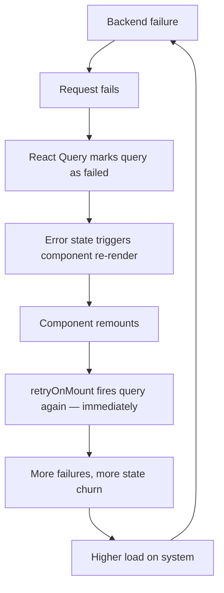
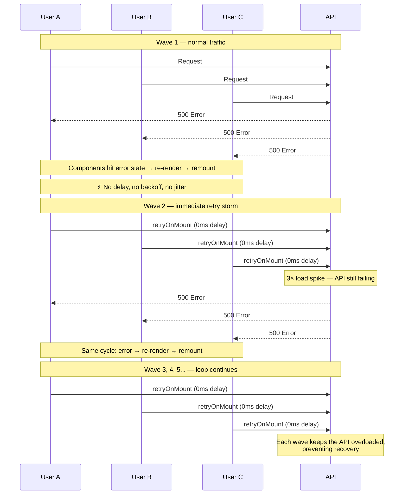
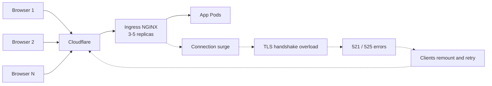

On June 26th, 2025, all of our products went down.

Not partially degraded. Not slow.

**Completely unavailable.**

Users saw this:


At first glance, this looked like an infrastructure or SSL issue.

It wasn't.

## What Happened

The incident started with a backend issue.

A database operation caused blocking, which made parts of our backend unstable. Requests started failing.

This alone should not have taken down the entire system.

But it did.

## The Unexpected Trigger

As backend errors increased, something else started happening:

> The frontend began sending dramatically more requests.

From Cloudflare data:

- Baseline: ~200–300K requests/min
- Spikes: **4M–5M requests/min**
- ~90–99% of requests were failing

This wasn't user traffic.

This was **amplified traffic**.

## The Hidden Feedback Loop

Our React Query setup looked safe at first glance:

```typescript
const queryClient = new QueryClient({
  defaultOptions: {
    queries: {
      retry: false,
      staleTime: TEN_SECONDS,
      cacheTime: TEN_MINUTES,
    },
  },
  logger: { log: noop, warn: noop, error: noop },
});
```

`retry: false` — no automatic retries. What could go wrong?

The problem was a setting we **didn't** set. In TanStack Query v4, [`retryOnMount`](https://tanstack.com/query/v4/docs/react/reference/useQuery) defaults to `true`. This means that even with `retry: false`, any failed query **retries when its component remounts**.

This is a critical distinction: the retries weren't driven by a timed backoff mechanism. They were driven by **component remounts**. Every time React re-rendered a component tree due to error state changes, queries that had previously failed would fire again immediately — no delay, no backoff, no jitter.

To make things worse, we had silenced React Query's logger with `noop`, making this behavior invisible during development.

### What actually happened



> Each failure triggered state changes, remounts, and immediate re-fetches — creating a self-reinforcing loop across thousands of users.

## Why Traffic Came in Waves

We didn't see steady load.

We saw **sharp spikes** repeating every few minutes.


Because retries were driven by component remounts rather than timed backoff, there was no randomization spreading requests over time. Users experiencing the same backend failure hit the same error states at roughly the same time, causing their components to remount — and retry — in sync.



> With exponential backoff, retries would spread out over time and give the API room to recover. With `retryOnMount`, every retry fires at 0ms delay on remount — so users that fail together retry together, creating synchronized waves that repeat until the system collapses.

## What the Data Showed

At peak:

- **~5M requests per minute**
- **>99% failure rate**
- Only a tiny fraction of requests succeeded

Edge status codes:


> The backend wasn't slow. It was unreachable.

## What Users Actually Saw

Users weren't seeing degraded performance.

They saw:

> **SSL handshake failed (525)**

That means:

- Browser working
- Cloudflare working
- Origin unreachable

> The system failed before requests even reached the application.

## What Actually Broke

This was not CPU. This was not database throughput.

This was **connection-level overload**.



Each remount-triggered retry:

- opened a new connection
- attempted a TLS handshake
- failed
- caused another remount and retry

At scale, this overwhelmed:

- Ingress NGINX (3–5 replicas in production)
- connection queues
- TLS handshake capacity

## Why Cloudflare Rate Limiting Didn't Save Us

Cloudflare rate limiting is useful, but it is not an instant global circuit breaker.

- It evaluates traffic over time windows starting from 10 seconds
- Enforcement is distributed across the global edge
- There can be delays before mitigation is applied

This matters when:

> Traffic jumps from normal to millions of requests in seconds

Cloudflare can reduce sustained overload. But it cannot fully stop **fast, synchronized retry bursts**.

## Can Ingress NGINX Help?

Yes — but with caveats.

Ingress NGINX supports request rate limiting and connection limits. However:

- **Global rate limiting is not supported**: The feature was [removed](https://github.com/kubernetes/ingress-nginx/pull/11851) from the controller to reduce complexity and maintenance overhead.
- **Limits are per IP**: Standard rate limiting is applied at the client IP level.
- **Limits are per ingress replica**: Each NGINX instance tracks its own limits locally.
- **Autoscaling changes effective limits**: If you scale from 3 to 10 replicas, your effective cluster-wide limit increases by more than 3x.
- **End of Life (EOL)**: The community-maintained `ingress-nginx` controller is scheduled for [retirement in March 2026](https://kubernetes.io/blog/2023/10/31/ingress-nginx-retirement/). The Kubernetes project now recommends migrating to the **Gateway API** for more robust, cluster-wide traffic management.

> It's a guardrail — not a perfect global throttle.

## The Real Root Cause

The backend issue was the trigger.

But the outage was caused by:

> **Frontend-driven retry amplification via `retryOnMount`**

## How We Prevent This Now

### 1. Fix the React Query config

The fix was straightforward — explicitly disable `retryOnMount`:

```ts
const queryClient = new QueryClient({
  defaultOptions: {
    queries: {
      retry: false,
      retryOnMount: false,
      staleTime: TEN_SECONDS,
      gcTime: TEN_MINUTES,
    },
  },
});
```

We also removed the silenced logger so query errors are visible during development.

### 2. Separate applications with cell-based isolation

This was our biggest infrastructure change. We introduced **separate Ingress NGINX Controllers with dedicated Load Balancers per application** — each product gets its own ingress controller and ingress class.

The goal: a retry storm on one application can't starve another's TLS capacity.

We treat each application as its own cell with:

- isolated ingress controller and load balancer
- isolated traffic path and TLS termination
- isolated scaling behavior
- separate cert-manager issuers per domain
- reduced blast radius

Even though the applications still run inside a shared Kubernetes cluster, failures in one application stay inside that application's boundary.

### 3. Add client-side circuit breakers

- pause retries after repeated failures
- deduplicate requests
- show degraded UI instead of retry loops

### 4. Improve edge and ingress protection

- Cloudflare rate limiting for coarse protection
- ingress connection limits as a last line of defense

### 5. Load test failure scenarios

We now test:

- 5xx storms
- retry amplification
- connection exhaustion

### 6. Add kill switches

- disable polling remotely
- turn off problematic queries
- degrade UI gracefully

## Final Takeaway

We didn't have a traffic spike.

We had a **retry amplification loop** — driven not by timed retries with backoff, but by a default React Query setting that fired queries immediately on every component remount.

It didn't just overload our APIs. It overloaded our ability to even establish a connection.

All from a single default we never explicitly set:

> `retryOnMount: true`
